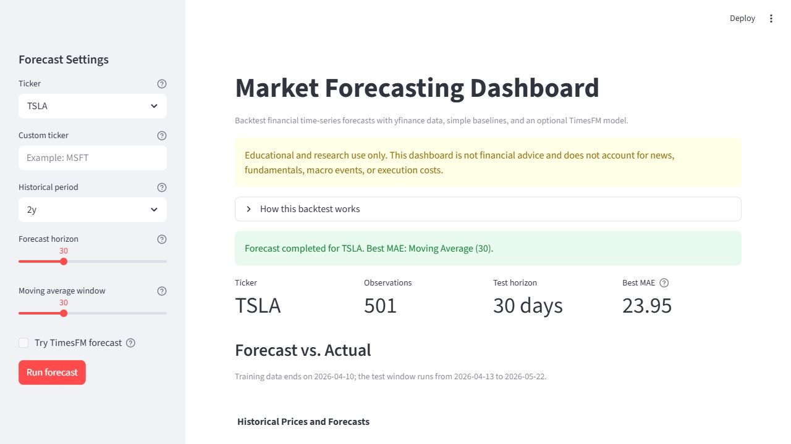

# Market Forecasting Dashboard with TimesFM

Interactive financial time-series forecasting dashboard using Google TimesFM, Streamlit, yfinance, Plotly, and baseline model evaluation.

## Overview

This project demonstrates a complete applied machine learning workflow for time-series forecasting:

1. Download real historical market data.
2. Clean and preprocess price data.
3. Forecast future values using Google TimesFM.
4. Compare model output against simple baseline models.
5. Evaluate forecasts with MAE, RMSE, and MAPE.
6. Visualize historical and predicted values in a Streamlit dashboard.
7. Export forecast results as CSV.

The goal is educational and technical demonstration, not investment advice.

## Demo

Live demo: https://your-streamlit-app-url.streamlit.app



## Features

- Select from common tickers such as AAPL, TSLA, NVDA, SPY, QQQ, and BTC-USD.
- Download historical market data with yfinance.
- Run naive and moving-average baseline forecasts.
- Integrate a TimesFM forecasting wrapper.
- Backtest using the most recent horizon as the test period.
- Forecast the next N business days using all available historical close prices.
- Display MAE, RMSE, and MAPE comparison table.
- Visualize historical data and forecasts with Plotly.
- Download forecast results as CSV.

## Tech Stack

- Python
- Streamlit
- pandas
- numpy
- yfinance
- Plotly
- scikit-learn
- TimesFM

## Project Structure

```text
market-forecasting-dashboard/
├── app.py
├── requirements.txt
├── README.md
├── .gitignore
├── src/
│   ├── __init__.py
│   ├── data_loader.py
│   ├── forecasting.py
│   ├── baselines.py
│   ├── metrics.py
│   └── plotting.py
├── data/
│   └── .gitkeep
├── assets/
│   └── dashboard_screenshot.png
└── reports/
    └── project_summary.md
```

## Methodology

The dashboard uses a simple backtesting setup:

1. Download the full historical price series.
2. Reserve the last `forecast horizon` observations as the test set.
3. Use the earlier observations as the training/history set.
4. Generate forecasts for the test period.
5. Compare predictions with actual test values.

Baseline models include:

- Naive forecast: future values equal the last observed value.
- Moving average forecast: future values equal the average of the last N observations.

The dashboard supports two modes:

- Backtest Mode: reserves the most recent horizon as a test set, forecasts that period, and reports MAE, RMSE, and MAPE against actual prices.
- Future Forecast Mode: trains each model on all available historical close prices and predicts the next selected number of business days. This mode does not report error metrics because actual future prices are not available yet.

TimesFM is integrated through a modular wrapper in `src/forecasting.py` so the forecasting pipeline remains easy to extend. The wrapper supports the newer TimesFM 2.5 style API with `TimesFM_2p5_200M_torch.from_pretrained(...)`, `ForecastConfig(...)`, and `model.forecast(horizon=..., inputs=...)`. It also keeps a fallback path for the older `TimesFm` API used by PyPI releases. If TimesFM cannot be imported or loaded in the current environment, the dashboard still runs with baseline models and displays a clear warning.

## How to Run

Clone the repository:

```bash
git clone https://github.com/juju123-web/market-forecasting-dashboard.git
cd market-forecasting-dashboard
```

Create and activate a virtual environment:

```bash
python -m venv .venv
source .venv/bin/activate  # macOS/Linux
# .venv\Scripts\activate   # Windows
```

Install dependencies:

```bash
pip install -r requirements.txt
```

Run the dashboard:

```bash
streamlit run app.py
```

## Deploy on Streamlit Community Cloud

This repository is organized for Streamlit Community Cloud:

- App entry point: `app.py`
- Dependency file: `requirements.txt`
- Target branch: `main`

To deploy:

1. Push the latest code to GitHub.
2. Go to [Streamlit Community Cloud](https://streamlit.io/cloud).
3. Create a new app from the GitHub repository.
4. Select repository `juju123-web/market-forecasting-dashboard`.
5. Select branch `main`.
6. Set the main file path to `app.py`.
7. Deploy the app and copy the generated `.streamlit.app` URL.
8. Replace the placeholder live demo URL in this README with the deployed app URL.

Streamlit Community Cloud creates a fresh Python environment for the app and installs packages from `requirements.txt`. If dependencies change, commit the updated `requirements.txt` and redeploy or reboot the app from the Streamlit Cloud dashboard.

## TimesFM Compatibility Notes

TimesFM may require Python 3.10 or 3.11 plus compatible ML backend packages. On Python 3.11, the PyPI torch install path is commonly:

```bash
pip install "timesfm[torch]"
```

For the latest TimesFM 2.5 code path, follow the official Google Research repository installation instructions. Streamlit Community Cloud resource limits and Python version availability may make real TimesFM inference unavailable or slow. This app is designed to remain usable in that case: keep `Try TimesFM forecast` unchecked, or let the app skip TimesFM and show the baseline forecasts with a clear warning.

## Evaluation Metrics

- MAE: Mean Absolute Error
- RMSE: Root Mean Squared Error
- MAPE: Mean Absolute Percentage Error

## Limitations

Financial markets are noisy, non-stationary, and affected by external events that are not captured by historical price data alone. Forecasts from this dashboard should be interpreted as model outputs for research and educational purposes only.

## Future Improvements

- Add confidence intervals or quantile forecasts.
- Add ARIMA or Prophet as additional baselines.
- Add multi-asset comparison.
- Add rolling-window backtesting.
- Deploy on Streamlit Community Cloud or Hugging Face Spaces.

## Disclaimer

This project is for educational and research purposes only. It is not financial advice. Do not use this dashboard as the sole basis for investment decisions.
